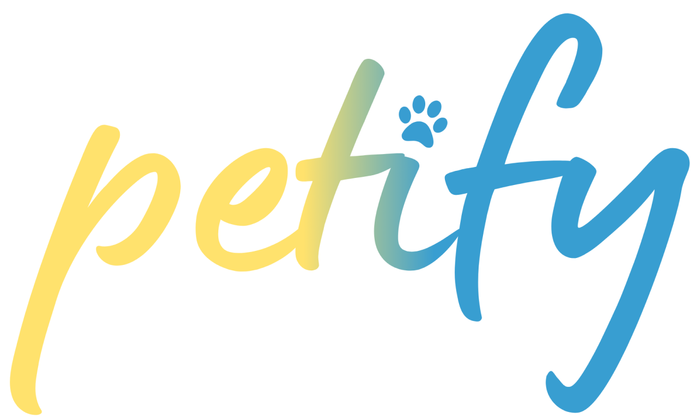

<p align="center">
  
</p>
<br>
<p align="center">
  
</p>

# Petify

### TCC — Etec de Taboão da Serra

Um aplicativo de monitoramento inteligente para pets, que une uma coleira conectada a um app mobile para acompanhar a saúde, localização e bem-estar do animal em tempo real. O Petify nasce da ideia de que cuidar de um pet à distância não deveria depender de adivinhação.

<p align="center">
  <a href="COLOQUE-AQUI-O-LINK-DO-SITE-OU-REPOSITORIO-DO-HARDWARE">
     <strong>Acessar o repositório do firmware/hardware</strong>
  </a>
</p>

## Sobre

O Petify simplifica o cuidado com pets por meio de:

* Coleira inteligente com sensores (Arduino/C++) conectada ao app
* Cadastro e gerenciamento de múltiplos pets por usuário
* Alertas configuráveis por regras, disparados a partir dos dados do dispositivo
* Relatórios de saúde e atividade do pet
* Autenticação e sincronização de dados via Supabase
* Onboarding guiado — do cadastro do usuário ao primeiro pet

A proposta é dar tranquilidade ao tutor, tornando visível o que antes só podia ser notado durante o contato direto com o animal.

## Tecnologias

<p align="center">
  
  &nbsp;&nbsp;&nbsp;
  
  &nbsp;&nbsp;&nbsp;
  
  &nbsp;&nbsp;&nbsp;
  
  &nbsp;&nbsp;&nbsp;
  
  &nbsp;&nbsp;&nbsp;
  
</p>
<p align="center">
  React Native &nbsp;·&nbsp; Expo &nbsp;·&nbsp; TypeScript &nbsp;·&nbsp; Supabase (PostgreSQL) &nbsp;·&nbsp; Arduino / C++
</p>

## Como Rodar

Clone o repositório e instale as dependências:

```bash
git clone https://github.com/seu-usuario/petify-app.git
cd petify-app
npm install
```

Configure as variáveis de ambiente criando um arquivo `.env` a partir do `.env.example`:

```bash
EXPO_PUBLIC_SUPABASE_URL=<SUA_URL_SUPABASE>
EXPO_PUBLIC_SUPABASE_PUBLISHABLE_KEY=<SUA_CHAVE_SUPABASE>
```

Inicie o servidor de desenvolvimento:

```bash
npx expo start
```

Escaneie o QR code com o Expo Go no seu dispositivo.

## Estrutura do Projeto

```
petify-app/
├── app/
│   ├── (auth)/                  # Cadastro, login, recuperação de senha
│   │   ├── sign-in.tsx
│   │   ├── sign-up.tsx
│   │   ├── sign-up-pet.tsx
│   │   ├── forgot-password.tsx
│   │   ├── verify-code.tsx
│   │   └── new-password.tsx
│   ├── (tabs)/                  # Navegação principal do app
│   │   ├── home.tsx             # Visão geral do pet
│   │   ├── devices.tsx          # Gerenciamento da coleira
│   │   ├── reports.tsx          # Relatórios de saúde e atividade
│   │   └── profile.tsx          # Perfil do usuário
│   └── index.tsx
├── components/
│   ├── AddPetForm.tsx / AddPetModal.tsx   # Cadastro de pets
│   ├── EditPetFieldModal.tsx              # Edição de dados do pet
│   ├── PetSwitcher.tsx                    # Alternância entre pets
│   ├── RequirePetGate.tsx / NoPetScreen.tsx
│   ├── ProfileOptions.tsx / ChangePasswordModal.tsx
│   ├── ConfirmModal.tsx
│   └── sucessSignUser.tsx
├── contexts/
│   └── PetsContext.tsx          # Estado global dos pets do usuário
├── lib/
│   ├── actions/                 # Regras de negócio (usuário e pets)
│   │   ├── user-actions.ts
│   │   └── pet-actions.ts
│   ├── types/types.ts           # Tipos compartilhados (Pet, SignUp, etc.)
│   ├── utils/storage-utils.ts   # Upload e manipulação de imagens
│   ├── supabase.ts              # Cliente Supabase
│   └── config.ts
└── assets/
    └── images/                  # Logo, ícones e imagens da coleira
```


## Licença

MIT
